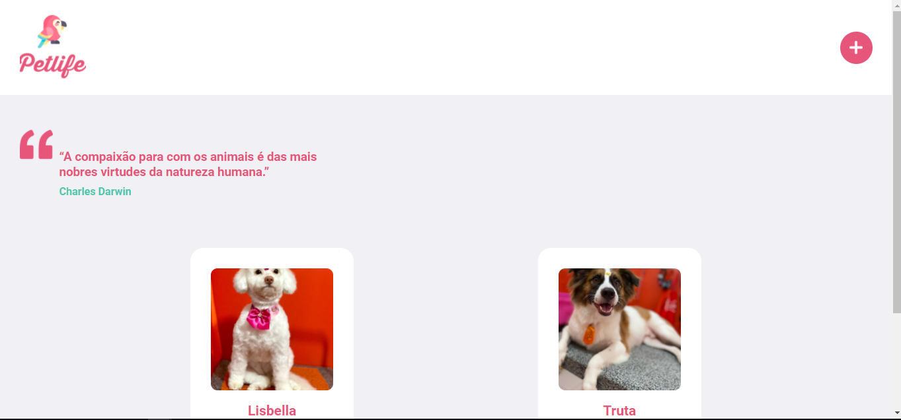

# Pet life

### Sistema com um único e bem definido motivo: Vê o seu pet! Cadastre seu bixinho agora mesmo e mostre ele pra todo mundo.

### acesse o projeto em: https://pet-life.vercel.app/




### Para utilizar este app

```bash
# Clone o repositório
git clone https://github.com/WesleyyRafaell/post2b

# Entre na pasta que foi gerada
cd post2b 

# Execute o comando
yarn start
```

### Bibliotecas utilizadas
```bash
* firebase
* react-hook-form
* hookform/resolvers
* yup
* react-loader-spinner
* react-router-dom
```